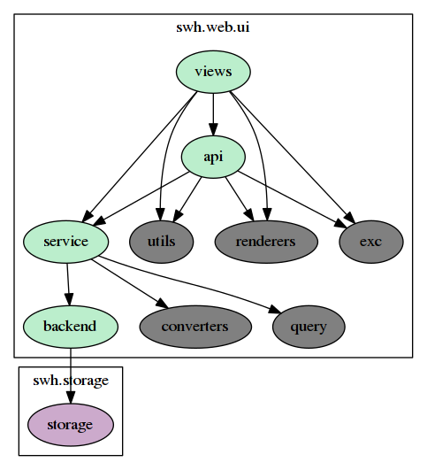

README-dev
==========

# Run server

Either use the django manage script directly (useful in development mode as it offers various commands).
The configuration will be taken from the default configuration file: '~/.config/swh/webapp.yml'.
```
python3 -m swh.web.manage runserver
```

or use the following command:

```
./bin/swh-web-dev --config <path_to_config_file>
```

# modules' description

## Layers

Folder swh/web/api/:

- views          main api endpoints definitions (html browsable + json + yaml)
- service        Orchestration layer used by views module.
                 In charge of communication with `backend` to retrieve
                 information and conversion for the upper layer.
- backend        Lower layer in charge of communication with swh storage.
                 Used by `service` module.

In short:
1. views -depends-> service -depends-> backend     ----asks----> swh-storage
2. views <- service <- backend                     <----rets---- swh-storage

## Utilities

Folder swh/web/api/:

- apidoc         Browsable api functions.
- apiresponse    Api response utility functions
- apiurls        Api routes registration functions
- exc            Exception definitions
- converters     conversion layer to transform swh data to serializable data.
                 Used by `service` to convert data before transmitting to `api` or `views`.
- query          Utilities to parse data from http endpoints.
                 Used by `service`
- utils          Utilities used throughout swh-web-api.

### About apidoc

This is a 'decorator tower' that stores the data associated with the
documentation upon loading the apidoc module. The top decorator of any
tower should be @apidoc.route(). Apidoc raises an exception if this
decorator is missing, and flask raises an exception if it is present
but not at the top of the tower.

## Graphics summary

    
